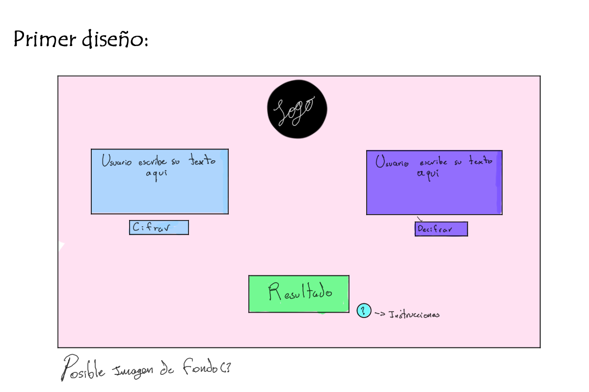
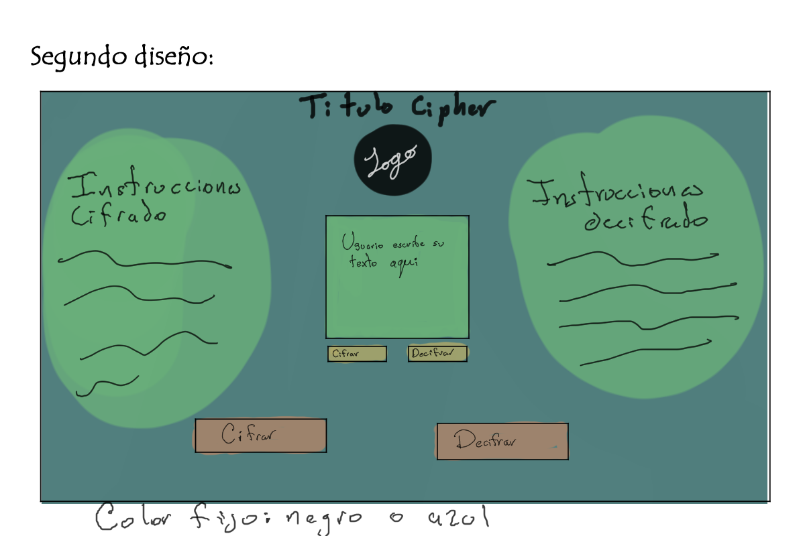
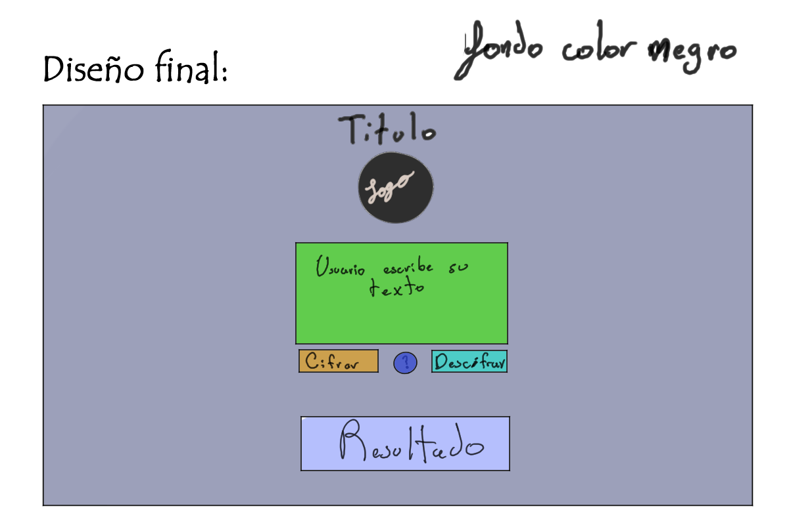
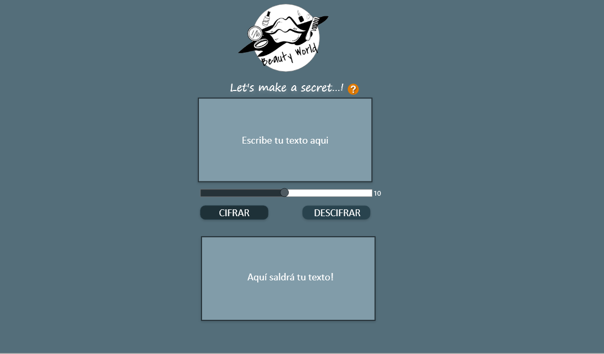

# ✨Cifrado Cesar✨
**by Karen Baron🌸**

## Índice

* [1. Introducción](#1-introduccion)
* [2. Características del proyecto](#2-caracteristicas-del-proyecto)
* [3. Diseño del programa](#3-diseño-del-programa)
* [4. Paso a paso](#4-paso-a-paso)
* [5. Instrucciones de uso](#5-instrucciones-de-uso)
* [6. Conclusiones](#6-conclusiones)
* [7. Cheklist](#7-cheklist)
* [8. Objetivos de aprendizaje](#8-objetivos-de-aprendizaje)

                
----

## 1. Introducción

El Cifrado César fue inventado por el emperador Julio César. Consiste en mover cada letra un determinado número de espacios en el alfabeto. En el siguiente ejemplo se usa un desplazamiento de tres espacios, así que una B en el texto original se convierte en una E en el texto codificado.

### Ej:


-------------


## 2. Características del proyecto

La idea del proyecto era crear una web que permitiera crear mensajes cifrados para una empresa de maquillaje que desea evitar que sus nuevas recetas sean robadas por sus competidores, siendo así, la empresa pidió una página web que fuera sencilla e intuitiva, usando una paleta de colores azules, con un botón de instrucciones, dos botones para cifrar y descifrar, una barra para escoger los espacios que se corre en el abecedario y que muestre el logo de la empresa para identificar que pertenece a esta. La web esta pensada para la protección de datos privados para las empresas, siendo esta web fácil de usar para los trabajadores, siendo mayoritariamente para un público adulto.

Este es el esquema que cree para poder realizar el proyecto con las cosas básicas que debía realizar el programa para hacerlo funcional:


-------------

## 3. Diseño del programa

Luego de determinar la función que tendría la web me puse a trabajar en el diseño de esta, como iba a estar organizada, como iban a ser los botones y en qué espacio saldría la respuesta, más que todo fueron decisiones creativas.


**Primer diseño:**

En este primer diseño trate de crear dos cuadros para ingresar el texto para cifrar y descifrar y un tercer cuadro para mostrar el resultado, en este, el botón de instrucciones estaría al lado del cuatro de resultado y no tendría ningún título distintivo del programa.

**Segundo diseño:**

En este segundo diseño decidí incluir el titulo del proyecto por encima del logo de la empresa para saber de que se trataba, comparado con el primero, tanto el cifrado como el descifrado tendrían sus propios cuadros donde saldrían sus resultados y solo un cuadro donde el usuario ingresaría su texto con sus respectivos botones para saber la respuesta, en este no habría un botón de instrucciones ya que estas estarían a cada lado. 

**tercer diseño:**

Y por fin decidí como seria el ultimo diseño, dejando algo más sencillo donde el usuario podría ingresar su texto, ver los dos botones y un recuadro donde saldría el resultado, además de una barra en la aparte de abajo donde podrá escoger cuantos espacios correr en el abecedario, al recibir feedback en el primer sprint, decidí hacer un tooltip de las instrucciones para que fuera más fácil de entender para el usuario en vez de un botón.

**Ultimo diseño**


-------------

## 4. Paso a paso

Una vez definido el diseño que tendría mi página empecé con la base de HTML, pensado en donde iría el título, el logo, el textarea del texto, la barra de rango, los botones para enviar el mensaje, el tooltip de las instrucciones y por último un recuadro donde saldría el mensaje.

Una vez terminada la maquetación del HTML empecé primero con el JS, pensando como podría realizar el cifrado de una palabra, para ello primero realice un pequeño ***array*** con las letras en mayúsculas del abecedario y un ***let*** con el número de espacios que deseaba correr. Creando este pequeño código que me dio una idea de cómo empezar todo:

```javascript
const cipher = {
  enconde : function () {
    let string = ["A", "B", "C", "D", "E", "F", "G", "H", "I", "J", "K", "L", "M", "N", "O", "P", "Q", "R", "S", "T", "U", "V", "W", "X", "Y", "Z"];
    let offset = 33;
    let resultado = (offset + string) % 26;
    console.log(string[resultado]);
  }
```

Una vez entendido como funcionan los objetos en JavaScript y las funciones charCodeAt y fromCharCode empecé a experimentar como hacer el cifrador, dando por resultado el código que se puede visualizar en el archivo ***cipher.js***, donde pude hacer que la palabra que ingresa el usuario se descompusiera letra por letra y cambiara su valor con la formula encontrada en la documentación usando los caracteres ASCII para darle un nuevo valor a la letra, por ultimo usando un string donde todas las letras se uniría con la función ***.push*** y usando la función ***.join*** para juntarlas en un solo texto formando así el cifrador.

Ya para las pruebas busque una manera de que el código mandara un error con ***if*** y el comando ***throw new***, este lanzaría un error de type el cual consiste de que si el usuario no escribe un string tipo texto o un offset tipo número lanzaría el error.

Para hacer en la función de ***decode*** solo copie la formula del cifrador, cambiando únicamente el + por el - pasando de ser así:

```javascript
 let formula = ((numberAscii - 65 + offset)% 26) + 65;
```

A así:
```javascript
 let formula = ((numberAscii - 65 - offset)% 26) + 65;
```
Pero hacer esto me genero un pequeño problema, y fue que la formula no volvía a repetir el string desde el valor cero, ¿A qué me refiero con esto? Usando de ejemplo el nombre de mi gata que es **Poyo**, si yo quiero cifrar su nombre corriendo 4 pasos en el abecedario, el resultado de este cifrado seria **TSCS**, pero si tratabas de descifrarlo corriendo los mismo espacios el resultado sería **PO?O**, dando un signo de interrogación en vez de la letra **"Y"**, ¿Que paso? Que mi código estaba recibiendo números negativos y por estar usando los valores ASCII normalmente en vez de devolver la **"Y"** devolvía **“?”**, el valor ASCII de **"C"** que es la letra que reemplaza a la **"Y"** en el código cifrado tiene un valor ASCII de 67, al restar los cuatro espacios debería dar una vuelta al código y dar el numero de 89 que es la **"Y"**, pero en vez de eso cogía el número 63. Para solucionar esto use una variable ***If*** haciendo que si el valor de la formula era menor a 65 (siendo 65 la "A") sumara nuevamente las 25 letras del abecedario y siguiera con la resta, quedando así:

```javascript
 if(numberAscii >= 65 && numberAscii <= 90){
          equation = ((numberAscii - 65 - offset)% 26) + 65;
      if(equation < 65 && equation !== 32){
        equation = equation + 26;}
      }
```
Devolviendo así el texto deseado sin problemas.

-------------

## 5. Instrucciones de uso

Para poder hacer uso de la página web es necesario descargar el archivo del proyecto desde GitHub con el siguiente [link.](https://github.com/Dan13l4/BOG004-cipher "link") y luego ingresar al vinculo llamado ***index.html*** dentro de la carpeta ***src***.

Para usar el cifrador:
1. Por favor en el primer cuadro ingresa el texto que deseas cifrar
2. Escoge el número de pasos que quieres que se corra la letra en el abecedario.
3. Pulsa el botón -cifrar- para ver el resultado.

Para usar el descifrador:
1. Por favor ingresa el texto que quiera Descifrar
2. Escoge el número de pasos que se usaron para cifrar la palabra
3. Pulsa el botón -descifrar- para ver el resultado.


-------------

## 6. Conclusiones

Primera que nada, muchas gracias a laboratoria y a sus Coachs por su ayuda en este proyecto, además de mis compañeras, me dieron muy buenas ideas para el diseño de este proyecto y me destrancaron un poquito con las dudas que tenia sobre mi código. La verdad me divertí mucho en la realización de este proyecto y aprendí bastante sobre como usar los objetos en JS (de lo cual no tenía idea 😭), además de otros pequeños truquillos que fui aprendiendo a lo largo de la creación del proyecto, fue una experiencia bastante agradable y espero poder seguir avanzando asi!

-------------

## 7. Cheklist

* [X] `README.md` incluye info sobre proceso y decisiones de diseño.
* [x] `README.md` explica claramente quiénes son los usuarios y su relación con
  el producto.
* [X] `README.md` explica claramente cómo el producto soluciona los
  problemas/necesidades de los usuarios.
* [X] Usa VanillaJS.
* [X] Implementa `cipher.encode`.
* [X] Implementa `cipher.decode`.
* [x] Pasa linter con configuración provista.
* [X] Pasa pruebas unitarias.
* [X] Pruebas unitarias cubren 70% de _statements_, _functions_ y _lines_, y un
  mínimo del 50% de _branches_.
* [X] Interfaz permite elegir el `offset` o _desplazamiento_ a usar en el
  cifrado/descifrado.
* [X] Interfaz permite escribir un texto para ser cifrado.
* [X] Interfaz muestra el resultado del cifrado correctamente.
* [X] Interfaz permite escribir un texto para ser descifrado.
* [X] Interfaz muestra el resultado del descifrado correctamente.
---------------

## 8. Objetivos de aprendizaje

### HTML

- [X] **Uso de HTML semántico**

### CSS

- [X] **Uso de selectores de CSS**


- [X] **Modelo de caja (box model): borde, margen, padding**


### Web APIs

- [X] **Uso de selectores del DOM**


- [X] **Manejo de eventos del DOM (listeners, propagación, delegación)**

- [X] **Manipulación dinámica del DOM**


### JavaScript

- [X] **Tipos de datos primitivos**


- [X] **Strings (cadenas de caracteres)**


- [X] **Variables (declaración, asignación, ámbito)**


- [X] **Uso de condicionales (if-else, switch, operador ternario, lógica booleana)**


- [X] **Uso de bucles/ciclos (while, for, for..of)**


- [X] **Funciones (params, args, return)**


- [X] **Pruebas unitarias (unit tests)**


- [X] **Módulos de ECMAScript (ES Modules)**


- [X] **Uso de linter (ESLINT)**

- [X] **Uso de identificadores descriptivos (Nomenclatura y Semántica)**

### Control de Versiones (Git y GitHub)

- [X] **Git: Instalación y configuración**

- [X] **Git: Control de versiones con git (init, clone, add, commit, status, push, pull, remote)**

- [X] **GitHub: Creación de cuenta y repos, configuración de llaves SSH**

- [X] **GitHub: Despliegue con GitHub Pages**


### UX (User eXperience)

- [X] **Diseñar la aplicación pensando en y entendiendo al usuario**

- [X] **Crear prototipos para obtener feedback e iterar**

- [X] **Aplicar los principios de diseño visual**