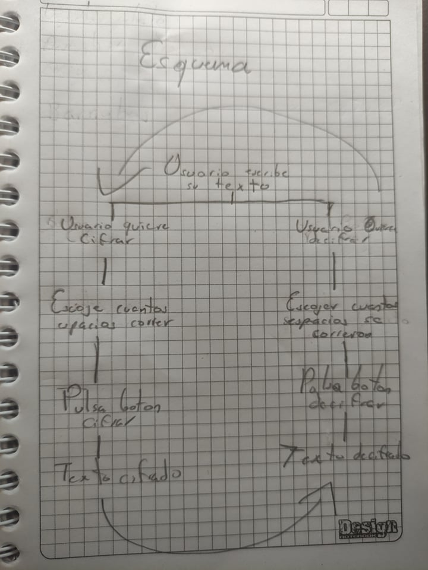

# Cifrado Cesar
**by Karen Baron**

## Índice

* [1. Introduccion](#1-introduccion)
* [2. Caracteristicas del proyecto](#2-caracteristicas-del-proyecto)
* [3. Diseño del programa](#3-diseño-del-programa)
* [4. Paso a paso](#4-paso-a-paso)
* [5. Instrucciones de uso](#5-instrucciones-de-uso)
* [6. Conclusiones](#6-conclusiones)
* [7. Cheaklist](#7-cheaklist)

                
----

## 1. Introduccion
-------------

El Cifrado César fue inventado por el emperador Julio César. Consiste en mover cada letra un determinado numero de espacion en el alfabeto. En el siguiente ejemplo se usa un desplazamiento de tres espacios, asi que una B en el texto original se convierte en una E en el texto codificado.

### Ej:

-------------

## 2. Caracteristicas del proyecto

-------------

La idea del proyecto era crear una web que permitiera crear mensajes cifrados para una empresa de maquillaje que desea evitar que sus nuevas recetas sean robadas por sus competidores, siendo asi, la empresa pidio que la pagina fuera sencilla e intuitiva, con un estilo monocromatico, con un boton de instrucciones, dos botones para cifrar y decifrar, una barra para escoger los espacios que se corre en el abecedario y que muestre el logo de la empresa para identificar que pertenece a esta.

El web esta pensanda para la proteccion de datos privados para las empresas, siendo esta web facil de usar para los trabajadores, siendo mayoritariamente para un publico adulto.

Este es el esquema que cree para poder realizar el proyecto con las cosas basicas que debia realizar el programa para hacerlo funcional:

-------------

## 3. Diseño del programa

## 4. Paso a paso

## 5. Instrucciones de uso

## 6. Conclusiones

## 7. Cheaklist

* [ ] `README.md` incluye info sobre proceso y decisiones de diseño.
* [ ] `README.md` explica claramente quiénes son los usuarios y su relación con
  el producto.
* [ ] `README.md` explica claramente cómo el producto soluciona los
  problemas/necesidades de los usuarios.
* [X] Usa VanillaJS.
* [X] Implementa `cipher.encode`.
* [X] Implementa `cipher.decode`.
* [ ] Pasa linter con configuración provista.
* [X] Pasa pruebas unitarias.
* [X] Pruebas unitarias cubren 70% de _statements_, _functions_ y _lines_, y un
  mínimo del 50% de _branches_.
* [X] Interfaz permite elegir el `offset` o _desplazamiento_ a usar en el
  cifrado/descifrado.
* [X] Interfaz permite escribir un texto para ser cifrado.
* [X] Interfaz muestra el resultado del cifrado correctamente.
* [X] Interfaz permite escribir un texto para ser descifrado.
* [X] Interfaz muestra el resultado del descifrado correctamente.